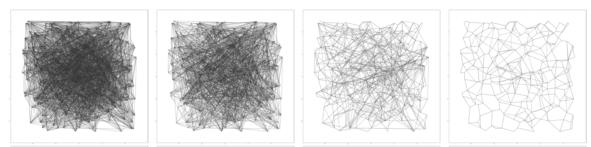

## Vamana: Index for serving Approximate Nearest Neighbour queries


<br clear="left"/>


Vamana is the vector search index that powers [DiskANN](https://proceedings.neurips.cc/paper_files/paper/2019/file/09853c7fb1d3f8ee67a61b6bf4a7f8e6-Paper.pdf), the billion scale fast approximate nearest neighbor search system. 

Most popular Vector Search databases like Pinecone, Qdrant currently implement their indexes based on [Hierarchical Navigable Small Worlds](https://arxiv.org/pdf/1603.09320) also referred to as HNSW. Results in the DiskANN paper claim that DiskANN offers better results than HNSW and faster indexing time. 

Vamana is similar to HNSW in that it creates a graph data structure that is optimized for GreedySearch to arrive at the k nodes nearest to a target search query node. 
Unlike HNSW which creates multiple levels of graphs, Vamana maintains a single graph structure but allows the edges in the graph to be agressively pruned by a configurable parameter `alpha`. 

By implementing the Vamana indexing algorithm we can visualize the structure of the graph at different stages of the algorithm to build an intutive sense of how it works.
Similar work has been done by [@brtholomy for HNSW](https://github.com/brtholomy/hnsw/tree/master) which is definitely worth a read.


## How it works

Vamana works by generating random edges between the points in the graph as a pre-processing step.
From here, we iterate over each point *p* in the graph and try to use the `GreedySearch` algorithm to arrive at the point *p* from some fixed point *s* by traversing the random graph.
By `GreedySearch` we mean, that at each step we pick the point closest to *p* and include it's neighbors as candidates for the next iteration of search.

The nodes traversed to arrive at the point *p* from *s* are candidates to be the edges of *p* in the graph. A high degree of edges can lead to a graph that takes longer to converge to the target node and consumes more memory.
To limit the search space, we use a procedure described as `RobustPrune(node, candidates, R, alpha)` to prune the candidate list and keep at most `R` edges for each node. The degree to which the search space is reduced can be conrolled by the parameter `alpha`.

Below, we can see the progression of a randomly generated graph at different points during the execution of the Vamana algorithm.


<br clear="left"/>


The paper describes that optimal results are obtained when Vamana is run twoce over the random graph. First with an `alpha` of 1 and the second time with `alpha` > 1.
A similar progression can be seen in the [paper](https://proceedings.neurips.cc/paper_files/paper/2019/file/09853c7fb1d3f8ee67a61b6bf4a7f8e6-Paper.pdf) with what appears to be a perturbed lattce graph.



<br clear="left"/>

## Graph Clustering Co-efficients

The generated graph depends on the number of time vamana is run and the value of `alpha`.
The paper recommends running Vamana twice on the dataset with `alpha` set to one for the first run. Below we can see the generated graph and clustering co-efficients by varying these parameters.

The graph had 200 nodes with `R` as 17 and `L` as 10.
The original clustering co-efficient of the graph is `0.1616`.


<br clear="left"/>


| Vamana Single run       | Vamana Double run alpha = (1, 2) | Vamana Double run alpha = (2, 2) |
| ----------------------- | -------------------------------- | -------------------------------- |
| 0.2891                  | 0.2996                           | 0.2907                           |
| 0.3046                  | 0.3035                           | 0.2870                           |
| 0.2873                  | 0.2817                           | 0.3288                           |
| 0.3056                  | 0.3027                           | 0.2992                           |

The images above reflect the output of the three configurations in the table in order.

The first figure shows Vamana run only once with `alpha` set to two. It looks the most cluttered due to high number of small edges.

The middle image is the standard configuration of running Vamana twice with the first with `alpha` set to one. It looks less cluttered due to higher number of long edges induced by aggressive pruning.

The last image shows the output when Vamana is run twice with `alpha` greater than one each time.
It looks the most sparse with a higher number of long edges.

Note that this visual analysis merely illustrates the pruning being done on a randonly generated graph. The actual performance of the graphs in answering nearest neighbor queries has not been analyzed in this experiment.

## Installation 

```
$ python -m venv env-name

$ env-name/bin/pip install -r requirements.txt
```

## Run

Run the command to generate images of the graph at different stages of the Vamana algorithm.
It should generate images in the `experiments` directory and print the clustering co-efficient of each iteration.

```
$ python vamana_greedy_search.py

Clustering co-efficient for graph original.png is:  0.1616837386707762
Running Vamana with alpha 1
Clustering co-efficient for graph experiments/iterations/iteration_1_0.png is:  0.1587900280270693
Clustering co-efficient for graph experiments/iterations/iteration_1_50.png is:  0.09781029671901736
Clustering co-efficient for graph experiments/iterations/iteration_1_100.png is:  0.08026208320403361
Clustering co-efficient for graph experiments/iterations/iteration_1_150.png is:  0.08092885812158251
Clustering co-efficient for graph experiments/iterations/iteration_1_199.png is:  0.09033022533022528
Updated R to:  5
Running Vamana with alpha: 2
Clustering co-efficient for graph experiments/iterations/iteration_2_0.png is:  0.09073498723498716
Clustering co-efficient for graph experiments/iterations/iteration_2_50.png is:  0.14424073149073133
Clustering co-efficient for graph experiments/iterations/iteration_2_100.png is:  0.20829964479964486
Clustering co-efficient for graph experiments/iterations/iteration_2_150.png is:  0.2588091630591632
Clustering co-efficient for graph experiments/iterations/iteration_2_199.png is:  0.2885460095460097
Clustering co-efficient for graph vamana.png is:  0.2885460095460097
Done
```

# Future work

 - Implement clustered indexing and storage to disk
 - Implement index search using Product Quantization and disk reads
 - Enhance index search by reading non-quantized vectors during neighborhood expansion